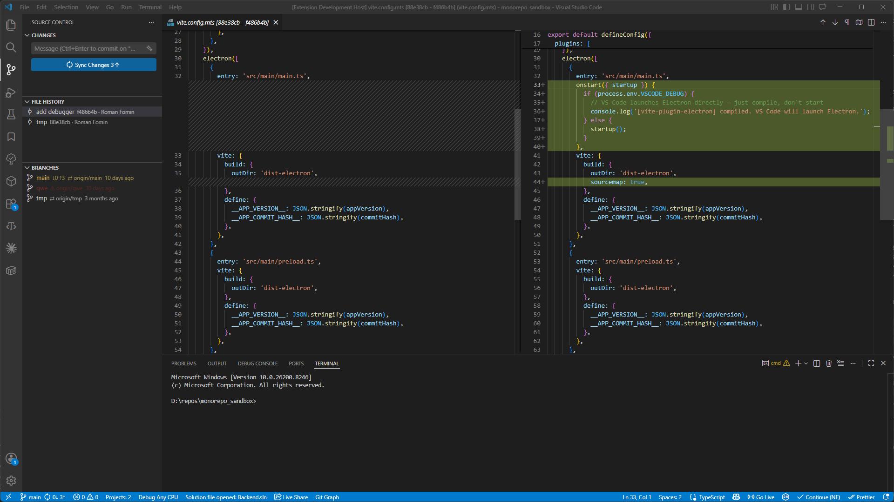

# Some Git Tools

Git utilities for VSCode:

- file commit history with diffs
- branch manager with gone-branch detection



## Features

### File History

Browse every commit that touched the currently open file, directly in the SCM panel.

- The list updates automatically as you switch between editor tabs.
- Each entry shows the commit message, short hash, and author.
- Hovering reveals the full hash, author, and timestamp in a tooltip.
- **Click any commit** to open a before/after diff in the editor.

When a diff tab is open (from clicking a commit), the File History view stays in sync — it highlights the commit that produced the diff you are looking at.

### Branch Manager

A branch list with status indicators, sorted so the most important branches surface first:
current branch → gone branches → all others alphabetically.

#### Gone Branches

When a remote tracking branch has been deleted upstream (e.g. after a merged PR), the local branch is highlighted in red with a `⚠ origin/branch-name` label.

Use the context menu to clean up in one step — delete the local ref and/or push the remote delete without leaving the editor.

#### Ahead/Behind Indicator

Branches that are out of sync with their upstream show `↓N ↑N` counts in yellow.

#### Context Menu

Right-click any branch for available actions:

| Action               | Available when                      |
| -------------------- | ----------------------------------- |
| Checkout             | Branch is not the current branch    |
| Delete Local Branch  | Always                              |
| Delete Remote Branch | Branch has an upstream tracking ref |

Deleting a local branch prompts for confirmation and offers a **Force Delete** option for branches with unmerged changes.

#### Feature Settings

Two theme colors can be overridden in your `settings.json`:

| Color ID                                | Default (dark) | Purpose                           |
| --------------------------------------- | -------------- | --------------------------------- |
| `someGitTools.goneBranchForeground`     | `#712922`      | Branches whose remote is gone     |
| `someGitTools.unsyncedBranchForeground` | `#d2ba5b`      | Branches ahead or behind upstream |

Example:

```json
"workbench.colorCustomizations": {
  "someGitTools.goneBranchForeground": "#ff4444"
}
```

---

## Requirements

- Git must be installed and available on `PATH`.
- A workspace folder must be open.
